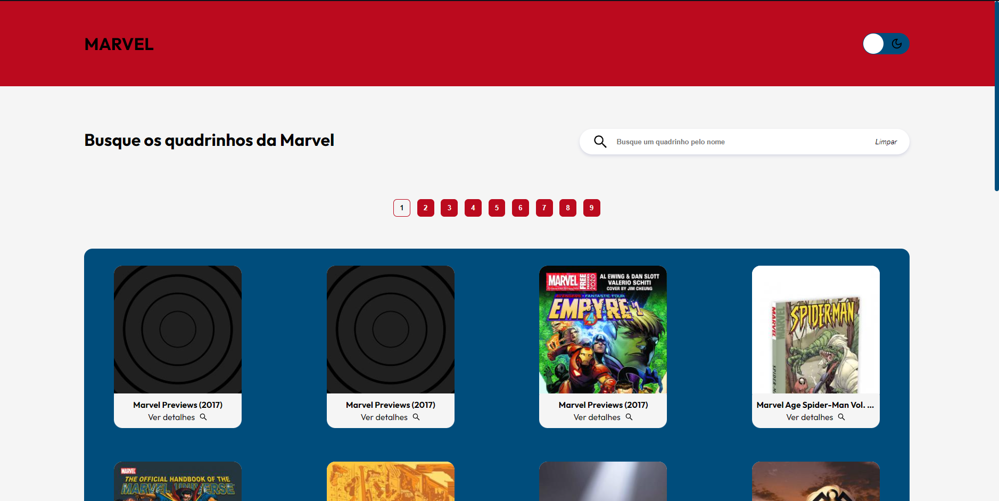
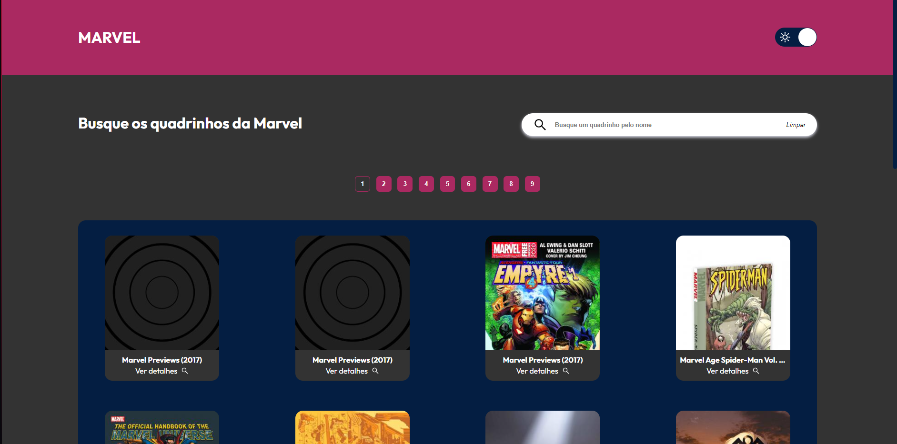
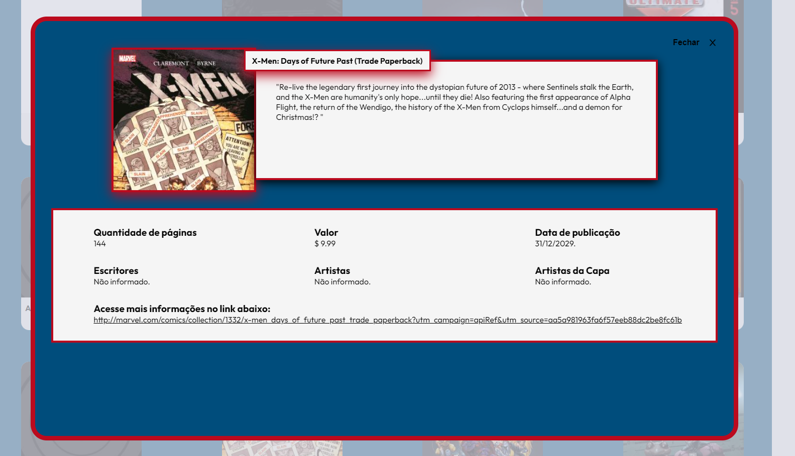
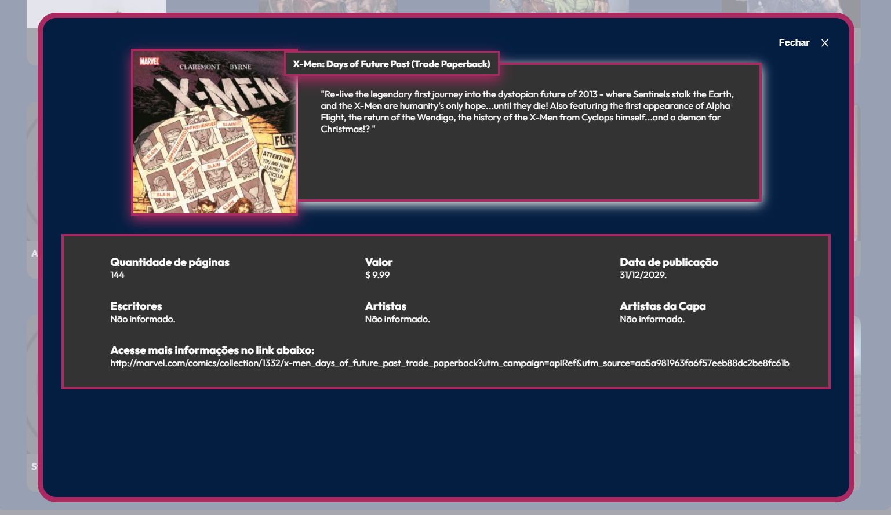
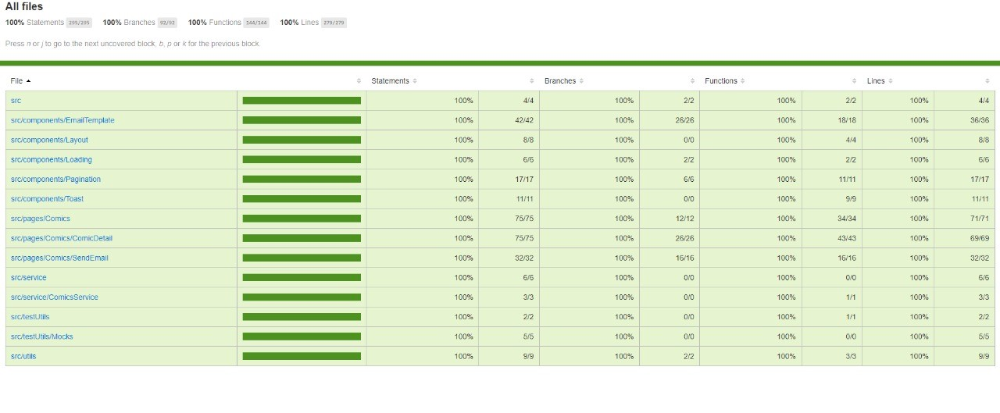

# MARVEL PROJECT

<h2 align="center"> Aplicação desenvolvida em React utlizando a base de dados da <a href="https://developer.marvel.com" target="_blank" rel="noreferrer"> Marvel API </a> </h2>

<h3> Principais recursos utlizadas : </h3>

<ul>
  <li> <a href="https://styled-components.com" target="_blank"> Styled Components </a> </li>
  <li> <a href="https://www.emailjs.com" target="_blank"> Email Js </a> </li>
  <li> <a href="https://testing-library.com/docs/react-testing-library/intro/" target="_blank"> React Testing Library </a> </li> 
  <li> <a href="https://formik.org/docs/overview" target="_blank"> Formik </a> </li>
  <li> <a href="https://www.npmjs.com/package/yup" target="_blank"> Yup </a> </li>
  <li> <a href="https://www.npmjs.com/package/md5" target="_blank"> Md5 </a> </li> 
  <li> <a href="https://axios-http.com/docs/intro" target="_blank"> Axios </a> </li>
  <li> <a href="https://momentjs.com" target="_blank"> Moment </a> </li>
  <li> <a href="https://fkhadra.github.io/react-toastify/introduction" target="_blank"> React Toastify </a> </li>
</ul>

### Para visualizar a aplicação no github pages acessar o link: https://paulohenriquesousa2020.github.io/marvel_project/

## Scripts do Package

### `yarn start`

Inicia o projeto em desenvolvimento. Acessar via http://localhost:3000 para visualizar o projeto no navegador.

### `yarn test`

Inicia o projeto de testes da aplicação com o coverage de testes. Para acessar o arquivo de coverage ir no diretório coverage\lcov-report\index.html e abrir no navegador ou acessar pela extensão Live server do Visual Studio Code. 

<h3> Interface WEB: </h3>
<table>
	<tr>
		<th width="100%">
			<h4>Aplicação com o light theme</h4>
		</th>
	</tr>
	<tr>
		<td>
			
		</td>
	</tr>
		<tr>
		<th width="100%">
			<h4>Aplicação com o dark theme</h4>
		</th>
	</tr>
	<tr>
		<td>
			
		</td>
	</tr>
		<tr>
		<th width="100%">
			<h4>Detalhe de um quadrinho com light theme<h4/>
		</th>
	</tr>
	<tr>
		<td>
			
		</td>
	</tr>
		<tr>
		<th width="100%">
			<h4>Detalhe de um quadrinho com dark theme</h4>
		</th>
	</tr>
	<tr>
		<td>
			
		</td>
	</tr>
  </tr>
  </table>
  
#### Aplicação responsiva para resoluções 1366x768 acima.

<h3> Coverage: </h3>

